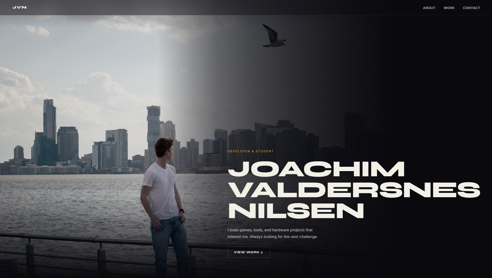

<div align="center">

[](https://joachimvn.github.io)

<br/>

[](https://joachimvn.github.io)
&nbsp;


*Personal portfolio. No frameworks, no build tools.*

**https://joachimvn.github.io**

</div>

---

## Projects

| Project | Stack | Source |
| --- | --- | --- |
| **After Hours** | Java · JavaFX | [repo](https://github.com/JoachimVN/After-Hours) |
| **CHORIDOR** | Java · JavaFX | [repo](https://github.com/JoachimVN/CHORIDOR) |
| **LEGO MINDSTORMS EV3** | Python | [page](https://joachimvn.github.io/lego.html) |

## Features

- GitHub API integration — cards pull live description, language and stars at runtime
- Screenshot carousel with per-project brand colors on the progress indicators
- Python syntax palette for LEGO MINDSTORMS EV3 source code

## Running locally

No build step. Serve the root with any static server:

```bash
npx serve .
```

Opening `index.html` directly works for most features, but the LEGO page loads Python source files via `fetch()` so a local server is needed there.

<details>
<summary>File structure</summary>

```text
index.html
lego.html
script.js
resources/
  css/style.css
  fonts/          Syne + Inter variable fonts
  images/         Photos, screenshots, logos
  code/           line_follower.py · waste_handler.py
```

</details>

---

<div align="center">
<sub>Built by <a href="https://github.com/JoachimVN">Joachim Valdersnes Nilsen</a></sub>
</div>
